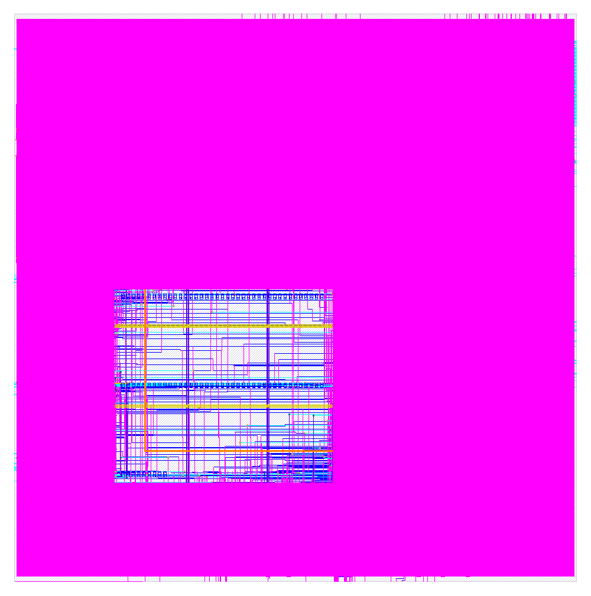

# PRJ-003 — Drone Controller SoC

**I designed the agentic ASIC framework. The framework autonomously produced this chip — no human wrote RTL, testbenches, or ran EDA tools.**



Tapeout-ready GDS on SkyWater 130nm. DRC/LVS clean. 10/10 autonomous stages audited PASS by Claude Opus 4.8.

---

## Chip Summary

| Metric | Value |
|--------|-------|
| **Core** | Ibex RV32IMC (lowRISC) |
| **Process** | sky130_fd_sc_hd (SkyWater 130nm) |
| **Frequency** | 50 MHz target (closed at +30ns WNS) |
| **SRAM** | 8 KB OpenRAM (blackbox hard macro) |
| **Modules** | 17 (3× UART, 2× SPI, I2C, GPIO, DShot PWM, Timer, Watchdog, IRQ Ctrl, Clock/Reset Mgr, Wishbone Interconnect, Ibex Core, SRAM, Caravel Wrapper) |
| **Gates** | ~146K standard cells |
| **Area** | 2,800 × 1,760 μm (Caravel user area) |
| **Power** | 1.8V core / 3.3V IO |
| **Flow** | LibreLane v3 (Yosys + OpenROAD + Magic + Klayout) |

---

## Stage Status

Every stage was dispatched, executed, and audited autonomously — no human intervention.

| # | Stage | Verdict | Retries |
|---|-------|---------|---------|
| 0 | Business Analysis | ✅ PASS | 1 |
| 1 | Specification | ✅ PASS | 0 |
| 2 | Architecture | ✅ PASS | 0 |
| 3 | Frontend (RTL) | ✅ PASS | 2 |
| 4 | Firmware | ✅ PASS | 0 |
| 5 | Verification | ✅ PASS | 0 |
| 6 | Promotion | ✅ PASS | 0 |
| 7 | Backend (P&R) | ✅ PASS 20/21 | 1 |
| 8 | Caravel Integration | ✅ PASS | 0 |
| 9 | Documentation | ✅ PASS | 0 |

---

## Key Results

### Backend (Physical Design)
- **Setup WNS:** +30.02 ns (comfortable margin at 50 MHz)
- **Hold WNS:** +0.09 ns
- **DRC:** 0 violations (Magic + Klayout)
- **LVS:** Netlist matches layout
- **Antenna:** 1 net waived (benign, diode-inserted)
- **GDS:** Produced in 3 formats (Magic, Klayout, final)
- **SRAM:** Blackbox verified — no behavioral flop expansion

### Verification
- **Testbenches:** 18 cocotb modules
- **Tests:** 368 total, 368 passed (100%)
- **Tier A modules:** 9 (high coverage)
- **Tier B modules:** 5 (functional coverage)
- **Tier C modules:** 4 (basic integration)
- **Failure clusters:** 0 (no RTL bugs found)

### Caravel Integration
- **mpw-precheck:** 3 runs, final PASS
- **DRC:** Clean on user_project_wrapper
- **BEOL check:** PASSED

---

## Repository Structure

The early-stage directories (business, specification, architecture) include only the primary output document — the full stage artifacts are extensive and were used to inform downstream stages, but the single document captures the essential technical content.

```
├── README.md
├── layout.png                  ← KLayout GDS render
├── .gitignore
├── waiver_ledger.json
├── 00_validation_report/       ← per-stage validation (11 reports)
├── 11_postmortem_audit/        ← postmortems + improvement plans (9 reports)
├── 01_business_stage/          ← market analysis
├── 02_specification_stage/     ← system specification
├── 03_architecture_stage/      ← architecture document
├── 04_frontend_stage/          ← RTL + lint/synth/formal/equiv logs
├── 05_firmware_stage/          ← BSP + drivers + bootrom
├── 06_verification_stage/      ← cocotb testbenches + results
├── 07_promote_stage/           ← per-module promotion reports
├── 08_backend_stage/           ← GDS + constraints + macros
├── 09_caravel_stage/           ← mpw-precheck logs + report
└── 10_document_stage/          ← documentation
```

> **Note on language stats:** Some Yosys intermediate files (`.il`, `.smt2`) from formal verification are excluded via `.gitignore`. These are tool byproducts, not hand-written code. Any remaining non-Verilog files in the formal directories are solver artifacts generated during BMC/k-induction proofs.

---

## Waivers

| ID | Stage | Reason |
|----|-------|--------|
| 3.14 | Frontend | Provenance banners (agent artifacts) |
| Antenna | Backend | 1 net, diode-inserted, benign per sky130 guidelines |

---

## Design Flow

```
Spec → Arch → RTL (lint/formal/synth/equiv) → Firmware (BSP/drivers/bootrom)
→ Verification (cocotb 368 tests) → Promotion → Backend (LibreLane P&R)
→ Caravel (mpw-precheck) → Document
```

**Self-audit gate:** Every stage audited by Claude Opus 4.8 (200 max-turns, high effort).
**Framework:** Hermes agentic ASIC workflow — Vera orchestration.

---

## Third-Party Components

This project integrates and redistributes the following open-source hardware components. Each retains its original license.

| Component | Source | License |
|-----------|--------|---------|
| Ibex RISC-V Core | lowRISC (ETH Zürich / Univ. of Bologna) | Apache 2.0 |
| OpenRAM SRAM Macro | OpenRAM Project | BSD 3-Clause |
| Caravel Harness | Efabless | Apache 2.0 |
| sky130 PDK | SkyWater / Google | Apache 2.0 |
| EF_UART, EF_SPI, EF_GPIO8, EF_TMR32, EF_WDT32, EF_I2C | Efabless IP Library | Apache 2.0 |

See [THIRD_PARTY.md](THIRD_PARTY.md) for full attribution and license text references.

---

## License

This project's original content (the agentic framework output, orchestration, and integration work) is licensed under Apache 2.0. Third-party components retain their original licenses as listed above. See [LICENSE](LICENSE).

---

*Generated autonomously by the Hermes ASIC workflow — July 19, 2026*
*No human wrote RTL, testbenches, constraints, or ran EDA tools for this chip.*
*This repository is a single commit by design — the framework iterated its work internally across 10 stages with Claude Opus audit gates. The commit is the signed-off deliverable, not a development log.*
